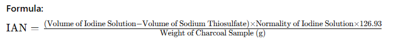

Determining the activity of activated bamboo charcoal, often evaluated by its adsorption capacity, can be achieved through various analytical methods. Below is a step-by-step outline of a standard chemical method, known as the iodine adsorption number (IAN) method. This method measures the amount of iodine adsorbed by the activated bamboo charcoal and is commonly used as an indicator of its activity.

##### Materials Needed:
1. Activated bamboo charcoal sample
2. Iodine solution (0.1 N)
3. Sodium thiosulfate solution (0.1 N)
4. Starch indicator
5. Distilled water
6. Glassware: flasks, burettes, pipettes, beakers, and funnels
7. Analytical balance
8. Magnetic stirrer (optional)

##### Procedure:
1. **Preparation of Iodine Solution:**
Prepare a 0.1 N iodine solution by dissolving iodine crystals in potassium iodide solution and diluting it to the desired concentration with distilled water.
2. **Weighing the Activated Bamboo Charcoal:**
Weigh out a specific amount (usually 0.5 to 1.0 grams) of the activated bamboo charcoal using an analytical balance.
3. **Adsorption Process:**
Add the weighed charcoal sample to a flask containing a known volume (usually 50 mL) of the 0.1 N iodine solution.
Stir the mixture for a set period, typically 30 minutes to 1 hour, using a magnetic stirrer.
4. **Filtration:**
After stirring, filter the mixture to separate the activated bamboo charcoal from the iodine solution.
5. **Titration of Iodine Solution:**
Titrate the remaining iodine in the filtrate with 0.1 N sodium thiosulfate solution until the solution turns pale yellow.
Add a few drops of starch indicator to the solution. The solution will turn blue, indicating the presence of iodine.
Continue titrating with sodium thiosulfate until the blue color disappears completely.
6. **Calculation of Iodine Adsorption Number:**
Calculate the iodine adsorption number (IAN) using the volume of sodium thiosulfate used in the titration. The iodine adsorption number is typically expressed as milligrams of iodine adsorbed per gram of activated charcoal.

​
 
##### Notes:

- Standardization: Ensure that all solutions are properly standardized before starting the experiment to obtain accurate results.
- Control Experiment: Run a control experiment without charcoal to determine the baseline iodine concentration.

##### Conclusion:
The iodine adsorption number (IAN) is a reliable indicator of the activity of activated bamboo charcoal. Higher iodine adsorption numbers correspond to more active charcoal with greater surface area and adsorption capacity.

This method is widely used in industry to evaluate the performance of activated charcoal in adsorption applications.
